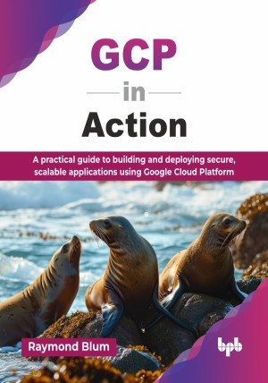

# GCP in Action

A practical guide to building and deploying secure, scalable applications using Google Cloud Platform.

This is the repository for [GCP in Action
](https://bpbonline.com/products/gcp-in-action?variant=44741276500168),published by BPB Publications.

## About the Book
Google Cloud Platform is a broad suite of deep infrastructure components and frameworks that an application developer or team can easily lose themselves in, without a clear path towards their goal: successful delivery of a product to their users.  It is a powerful suite of cloud computing services, and understanding how to build scalable, reliable applications on it is a critical skill for modern developers and architects.

This book provides a working set of GCP services and complementary products to illustrate the anatomy of an application that puts GCP services to good use, providing secure, scalable, and reusable back-end services to mobile and web front ends. You will learn to identify system stress points, choose between overlapping GCP services like App Engine and Cloud Run, and implement advanced strategies for component migration and maintenance. Web client, mobile, and desktop applications are developed to illustrate accessing GCP services from client platforms.

By the end of this book, you will not only be proficient in using GCP but will also possess a solid architectural mindset. You will be prepared to design, build, and maintain enterprise-grade applications, capable of handling real-world complexities and ensuring long-term success on the Google Cloud Platform.

## What You Will Learn
• Coding, configuration, and deployment of GCP services.

• Monitoring and alerting features of GCP products.

• Choosing optimal GCP services from overlapping alternatives.

• Scaling and load balancing of GCP services.

• Designing robust, backend-agnostic interfaces at the cloud border.

• Architectural design for scalable, reliable systems.

• Handling high-demand scaling using message queues and load balancing.
